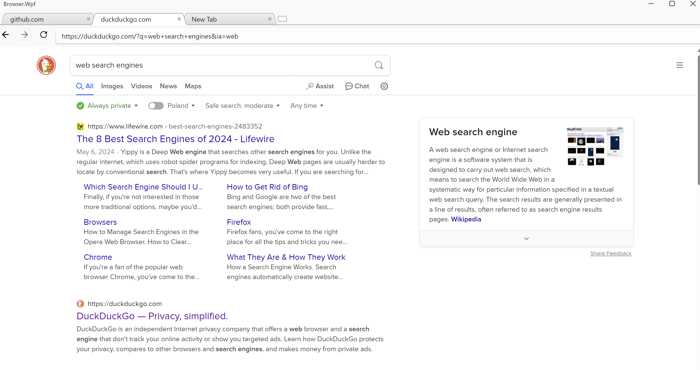
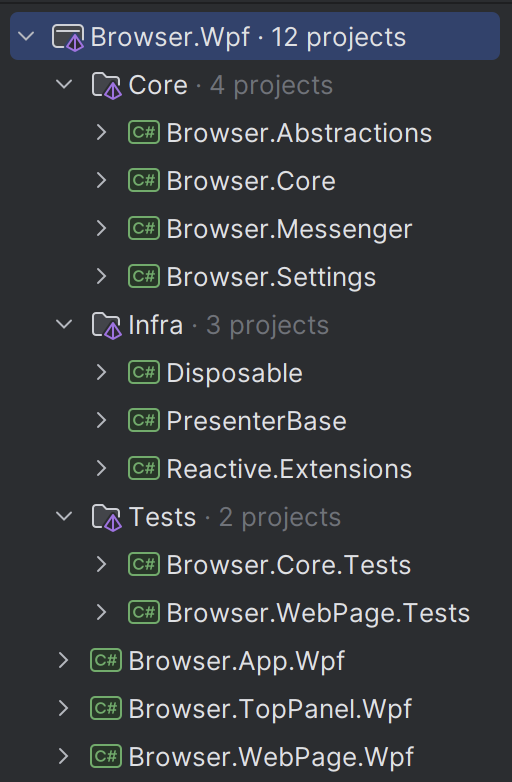
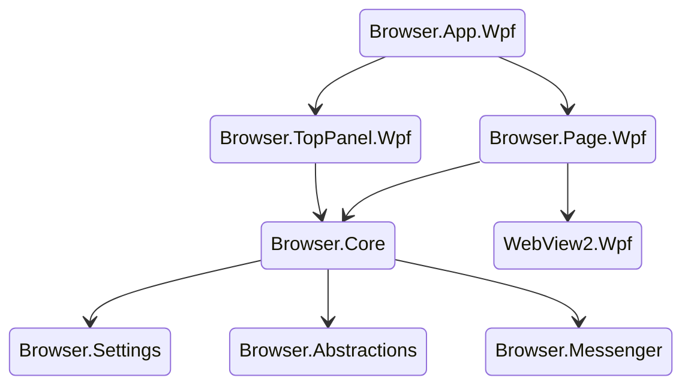

# Browser WebView2 WPF
> The current WPF application designed by [MVVM](https://en.wikipedia.org/wiki/Model%E2%80%93view%E2%80%93viewmodel),
> [MVP](https://en.wikipedia.org/wiki/Model%E2%80%93view%E2%80%93presenter) patterns
> by using [MVVM Toolkit](https://learn.microsoft.com/en-us/dotnet/communitytoolkit/mvvm/),
> [**WebView2**](https://learn.microsoft.com/en-us/microsoft-edge/webview2/) to render and manage web pages, 
> [Rx.NET](https://github.com/dotnet/reactive) & [IMessenger](https://learn.microsoft.com/en-us/dotnet/api/communitytoolkit.mvvm.messaging.imessenger?view=win-comm-toolkit-dotnet-7.0) for events-driven architecture,
> Microsoft.Extensions to provide [dependency injection](https://learn.microsoft.com/en-us/dotnet/core/extensions/dependency-injection),
> [logging](https://learn.microsoft.com/en-us/dotnet/core/extensions/logging?tabs=command-line),
> [configuration management](https://learn.microsoft.com/en-us/dotnet/core/extensions/configuration), 
> and [WPF UI](https://github.com/lepoco/wpfui) for user interface.
>
<div style="display: flex; flex-direction: row;">
 
 
</div>

## Projects structure

The project is organized into several key groups, each serving a distinct purpose within the overall architecture:
- `WPF`: Contains the WPF application projects with postfix `Wpf`.
- `Core`: Contains the core browser logic projects with prefix `Browser`, divided into isolated domains for clarity and maintainability.
    - _Browser.Core_
    - _Browser.Abstractions_
    - _Browser.Messenger_
    - _Browser.Settings_
- `Infra`: Contains the infrastructure parts, providing foundational services and utilities.
- `Tests`: Houses unit tests, ensuring reliability and robustness.
    - [xUnit](https://xunit.net//) unit testing framework.
    - Utilizes the [NSubstitute](https://nsubstitute.github.io/help/getting-started/) library for mocking dependencies in tests.




## Browser application structure

Simplified browser application structure


##  Browser.Abstractions

IBrowser
---

`IBrowser` defines the core interface for a browser, supporting navigation, page management, and observing browser state changes.

```csharp
/// <summary>
/// Defines the core interface for a browser, supporting navigation, page management, and observing browser state changes. 
/// It provides methods to create, load, reload, and remove pages, as well as manage the current page.
/// </summary>
public interface IBrowser : INavigationRouter, IBrowserObservable, IDisposable
{
    /// <summary>
    /// Creates a new page asynchronously using the provided options.
    /// </summary>
    /// <param name="options">Optional page creation options.</param>
    /// <param name="token">A cancellation token to cancel the operation.</param>
    /// <returns>A task representing the asynchronous page creation operation, returning the created page.</returns>
    Task<IPage> CreatePage(IPageCreateOptions? options, CancellationToken token = default);

    /// <summary>
    /// Loads a page asynchronously by its identifier.
    /// </summary>
    /// <param name="pageId">Optional page identifier to load. If null, the default page is loaded.</param>
    /// <param name="token">A cancellation token to cancel the operation.</param>
    /// <returns>A task representing the asynchronous load operation.</returns>
    Task LoadPage(PageId? pageId = default, CancellationToken token = default);

    /// <summary>
    /// Reloads a page asynchronously by its identifier.
    /// </summary>
    /// <param name="pageId">Optional page identifier to reload.</param>
    /// <param name="token">A cancellation token to cancel the operation.</param>
    /// <returns>A task representing the asynchronous reload operation.</returns>
    Task ReloadPage(PageId? pageId = default, CancellationToken token = default);

    /// <summary>
    /// Removes a page from the browser by its identifier.
    /// </summary>
    /// <param name="pageId">The identifier of the page to remove.</param>
    /// <returns>A task representing the asynchronous page removal operation.</returns>
    Task RemovePage(PageId pageId);

    /// <summary>
    /// Sets the current page by its identifier.
    /// </summary>
    /// <param name="pageId">The identifier of the page to set as the current page.</param>
    void SetCurrentPage(PageId pageId);
}
```

`IBrowserObservable` provides observables for browser-related events, such as page additions, removals, and current page changes.

```csharp
/// <summary>
/// Provides observables for browser-related events, such as page additions, removals, and current page changes. 
/// It also exposes a collection of pages and the current active page as observable values.
/// </summary>
public interface IBrowserObservable
{
    /// <summary>
    /// Gets an observable stream that notifies when a page is added.
    /// </summary>
    IObservable<IPage> PageAdded { get; }

    /// <summary>
    /// Gets an observable stream that notifies when a page is removed.
    /// </summary>
    IObservable<IPage> PageRemoved { get; }
    
    /// <summary>
    /// Gets an observable stream that notifies when a page is reloaded.
    /// </summary>
    IObservable<IPage> PageReloaded { get; }

    /// <summary>
    /// Gets a read-only list of all the pages in the browser.
    /// </summary>
    IReadOnlyList<IPage> Pages { get; }

    /// <summary>
    /// Gets the current active page as an observable value.
    /// </summary>
    IObservableValue<IPage> CurrentPage { get; }
}
```

IBrowserPage
---
`IBrowserPage` provides methods to load and reload the page, and manages navigation history.
```csharp
/// <summary>
/// Represents a browser page that supports navigation actions and is disposable. 
/// It provides methods to load and reload the page, and manages navigation history.
/// </summary>
public interface IBrowserPage : IPage, INavigationRouter, IDisposable
{
    /// <summary>
    /// Loads the page asynchronously.
    /// </summary>
    /// <param name="token">A cancellation token to cancel the load operation.</param>
    /// <exception cref="BrowserPageException">Thrown when a page-loading error occurs.</exception>
    /// <exception cref="OperationCanceledException">Thrown when the load operation is cancelled.</exception>
    /// <returns>A task representing the asynchronous load operation.</returns>
    Task Load(CancellationToken token = default);

    /// <summary>
    /// Reloads the page asynchronously.
    /// </summary>
    /// <param name="token">A cancellation token to cancel the reload operation.</param>
    /// <exception cref="BrowserPageException">Thrown when a page-reloading error occurs.</exception>
    /// <exception cref="OperationCanceledException">Thrown when the reload operation is cancelled.</exception>
    /// <returns>A task representing the asynchronous reload operation.</returns>
    Task Reload(CancellationToken token);
}
```

`IPage` represents a page within the browser, containing an identifier, title, and content.
```csharp
/// <summary>
/// Represents a page within the browser, containing an identifier, title, and content. 
/// It is also an observable path that provides access to the source URI.
/// </summary>
public interface IPage : IPathObservable
{
    /// <summary>
    /// Gets the unique identifier for the page.
    /// </summary>
    PageId Id { get; }

    /// <summary>
    /// Gets the title of the page.
    /// </summary>
    string Title { get; }

    /// <summary>
    /// Gets the content of the page.
    /// </summary>
    object Content { get; }
}
```


INavigationRouter
---

`INavigationRouter` defines the contract for navigation routing, providing methods to navigate forward, backward, reload, and push new navigation options.

```csharp
/// <summary>
/// Defines the contract for navigation routing, providing methods to navigate forward, backward, reload, and push new navigation options. 
/// It also provides properties indicating whether forward, back, or reload actions are possible.
/// </summary>
public interface INavigationRouter : IPathObservable
{
    /// <summary>
    /// Navigates forward in the navigation history.
    /// </summary>
    void Forward();
    
    /// <summary>
    /// Gets a value indicating whether navigation forward is possible.
    /// </summary>
    bool CanForward { get; }

    /// <summary>
    /// Navigates backward in the navigation history.
    /// </summary>
    void Back();
    
    /// <summary>
    /// Gets a value indicating whether navigation backward is possible.
    /// </summary>
    bool CanBack { get; }
    
    /// <summary>
    /// Reloads the current navigation context.
    /// </summary>
    void Reload();
    
    /// <summary>
    /// Gets a value indicating whether the reload action is possible.
    /// </summary>
    bool CanReload { get; }

    /// <summary>
    /// Pushes new navigation options to change the current navigation context.
    /// </summary>
    /// <param name="options">Navigation options containing the address or path to navigate to.</param>
    void Push(INavigateOptions options);
}
```

`INavigateOptions` represents navigation options for specifying the address or path to navigate.
```csharp
/// <summary>
/// Represents navigation options for specifying the address or path to navigate.
/// </summary>
public interface INavigateOptions
{
    /// <summary>
    /// Gets the address or path for navigation.
    /// </summary>
    string Address { get; }
}
```

`IPathObservable` defines an observable path interface that provides access to the current source URI through an observable value.
```csharp
/// <summary>
/// Defines an observable path interface that provides access to the current source URI through an observable value.
/// </summary>
public interface IPathObservable
{
    /// <summary>
    /// Gets an observable value representing the current source URI.
    /// </summary>
    IObservableValue<Uri> Source { get; }
}
```