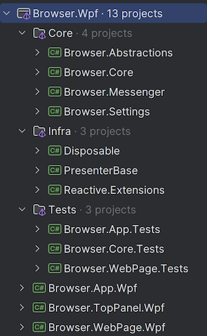

# Browser WebView2 WPF

> The current project use [**WebView2**](https://learn.microsoft.com/en-us/microsoft-edge/webview2/) to render web pages in WPF application.


## Project Structure

---
The project is organized into several key folder groups, each serving a distinct purpose within the overall architecture:
- `Wpf`: Contains the WPF application project with postfix `Wpf`.
- `Core`: Contains the core browser logic projects with prefix `Browser`, divided into isolated domains for clarity and maintainability.
    - _Browser.Core_
    - _Browser.Abstractions_
    - _Browser.Messenger_
    - _Browser.Settings_
- `Infra`: Contains the infrastructure parts of the project, providing foundational services and utilities.
- `Tests`: Houses unit tests for the project, ensuring reliability and robustness.
    - [xUnit](https://xunit.net//) unit testing framework.
    - Utilizes the [NSubstitute](https://nsubstitute.github.io/help/getting-started/) library for mocking dependencies in tests.

### Project Structure Overview


---

## Application structure

Simplified browser application structure

---


###  Browser.Abstractions

---
`IBrowser` provides access to global browser access

```csharp
    /// <summary>
/// Defines the core interface for a browser, supporting navigation, page management, and observing browser state changes. 
/// It provides methods to create, load, reload, and remove pages, as well as manage the current page.
/// </summary>
public interface IBrowser : INavigationRouter, IBrowserObservable
{
    /// <summary>
    /// Creates a new page asynchronously using the provided options.
    /// </summary>
    /// <param name="options">Optional page creation options.</param>
    /// <param name="token">A cancellation token to cancel the operation.</param>
    /// <returns>A task representing the asynchronous page creation operation, returning the created page.</returns>
    Task<IPage> CreatePage(IPageCreateOptions? options, CancellationToken token = default);

    /// <summary>
    /// Loads a page asynchronously by its identifier.
    /// </summary>
    /// <param name="pageId">Optional page identifier to load. If null, the default page is loaded.</param>
    /// <param name="token">A cancellation token to cancel the operation.</param>
    /// <returns>A task representing the asynchronous load operation.</returns>
    Task LoadPage(PageId? pageId = default, CancellationToken token = default);

    /// <summary>
    /// Reloads a page asynchronously by its identifier.
    /// </summary>
    /// <param name="pageId">Optional page identifier to reload.</param>
    /// <param name="token">A cancellation token to cancel the operation.</param>
    /// <returns>A task representing the asynchronous reload operation.</returns>
    Task ReloadPage(PageId? pageId = default, CancellationToken token = default);

    /// <summary>
    /// Removes a page from the browser by its identifier.
    /// </summary>
    /// <param name="pageId">The identifier of the page to remove.</param>
    /// <returns>A task representing the asynchronous page removal operation.</returns>
    Task RemovePage(PageId pageId);

    /// <summary>
    /// Sets the current page by its identifier.
    /// </summary>
    /// <param name="pageId">The identifier of the page to set as the current page.</param>
    void SetCurrentPage(PageId pageId);
}
```